# Threat Detection And SIEM System.

## DESCRIPTION 
The NIST cybersecurity framework 2.0 recommends a security monitoring system as an essential part of every business and Enterprise security. This Lab project aligns with the NIST Cybersecurity Framework by supporting the Identify, Protect, Detect, and Respond functions through centralized logging, network monitoring, intrusion detection, and incident analysis. Possible cybersecurity attacks and compromises are timely discovered and analysed using Security incident and Event management tool(Wazuh). This helps correlate realtime anomalies and other potential indicators of compromise (IOC) after which we take actions to contain or remediate detected incidents by responding. Responding inludes areas such as incident management, analysis, mitigation, reporting, and communication to all stake holders.


## Project Overview 
This lab is designed to demonstrate how real-time attacks can be detected and prevented using Wazuh EDR and SIEM monitoring system. It also includes network setup and configuration of a well-segregated enterprise network. Wazuh agents are installed on endpoints, while pfSense firewall logs are remotely forwarded using Syslog for centralised monitoring. The network configuration includes firewall rule configuration, VLAN setup, routing, NAT, and port forwarding. The network is also segmented into multiple zones, including LAN, DMZ, IT management network, and an external attack network, to simulate a secure enterprise environment. On the SIEM side, custom decoders and rules were created to enhance detection and monitoring capabilities.

In addition, I also simulated cybersecurity incidents using an attack machine to test efficiency  of the monitoring and detection system.


## TOOlS USED
Wazuh - Open sourced Security Information and Event management(SIEM) and Extended Detection and Response(XDR) tool. It comprises of an wazuh Agent and wazuh Manager. 
Hydra - A brute force tool designed to test password strength.

### Tecnhologies
Ubuntu server and Desktop
Windows endpoint
pfSense firewall
kali external machine

# skills tested/utilized
Log Analysis, Threat Detection, Linux Administration, Security Monitoring, Incident Response, Network Security, General Networking and Documentation.


## Project Implemetation phase
### Network setup and topology.
The project uses a segmented external and internal private network architecture, where systems located on the external network targets services hosted within a corporate environment. 


<center> 

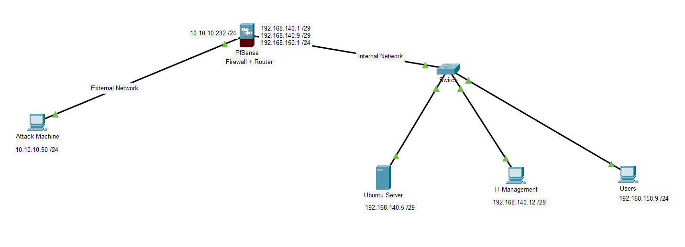

    Figure 1: Network Topology 
 </center>


The external attacker simulates a threat actor over the internet while the ubuntu server is a public server in the Demilitarized Zone(DMZ) of a organization.  The windows endpoint and wazuh dashboard servers are deployed internally in different virtual LAN. The pfsense firewall is deployed as perimeter security to safegaurd the private internal network.


 ### Network and Infrastructure Configurations.
 1. Firewall configuration :
 The lab work implements a roboust segreation of internal network bewteen the dmz , Management and the users. Network segmentation is enforeced via the firewall.Multiple virtual  network interfaces is configured which includes an external WAN interface.

 <center> 

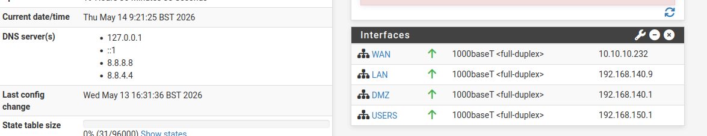

    Figure 2: Firewall interfaces/gateways 
 </center>
 
 
 Firewall rules, routing, network address translation (NAT), and port forwarding were configured to securely expose public-facing infrastructure(Web Server) through controlled firewall policies.

 <center> 

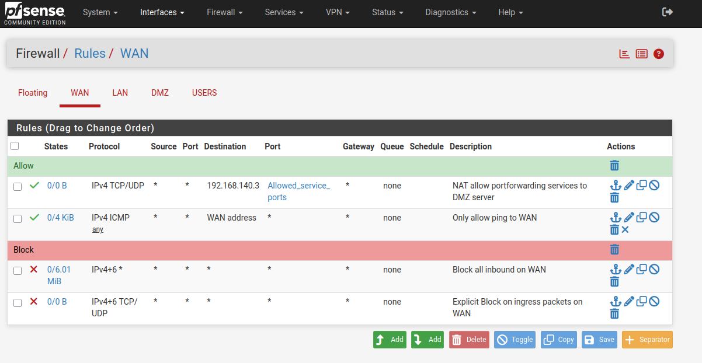

    Figure 3: WAN interface Rules 
 </center>

 <center> 

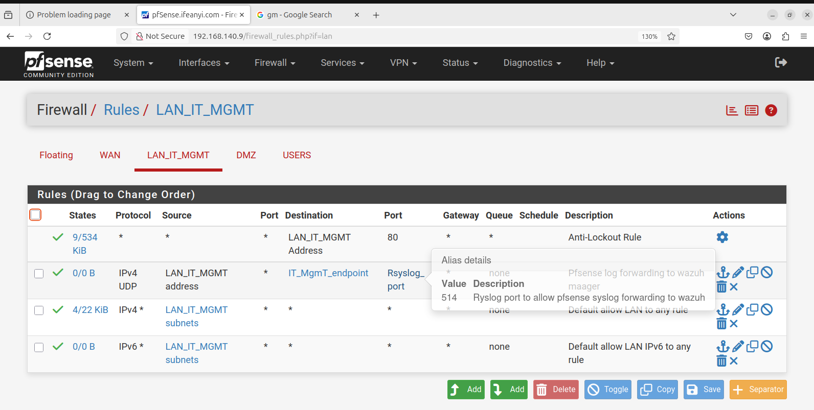

    Figure 4: LAN/Management interface Rules 
 </center>

 <center>

 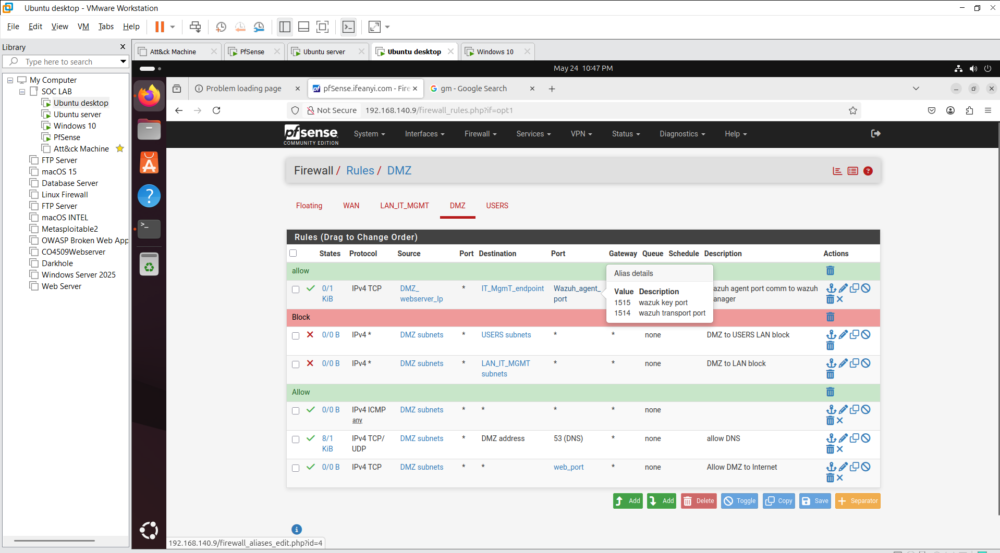

    Figure 5: DMZ interface Rules 
 </center>
 
  <center>
 
 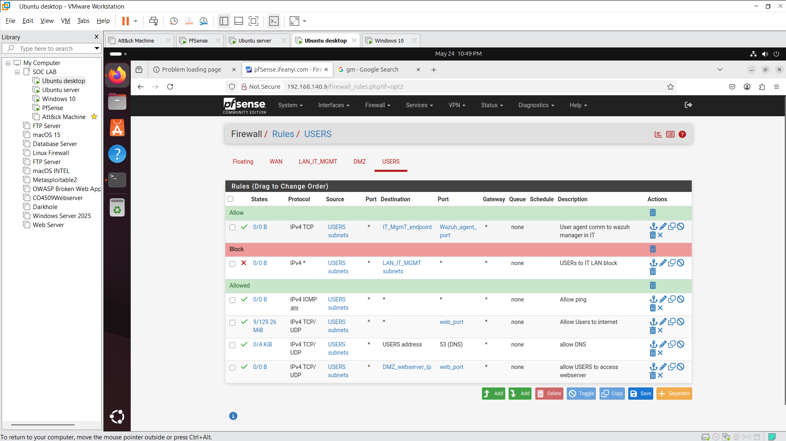

    Figure 6: USERs interface Rules 
 </center>

 <center>
 
 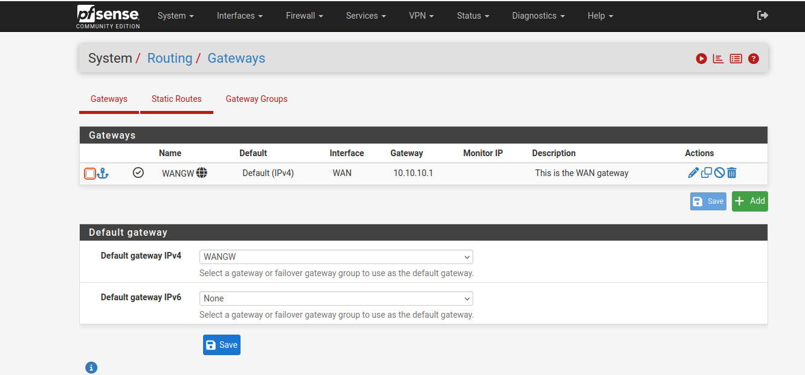

    Figure 7: Routing Configuration : Enables communication between virtual interfaces
 </center>

 <center>
 
 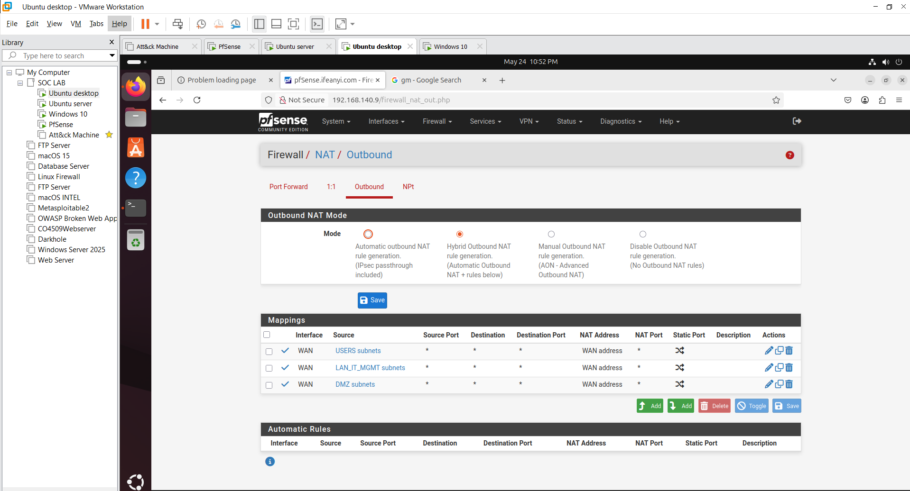

    Figure 8: NAT Configuration : This enables the internal private devices access the internet
 </center>


 <center>
 
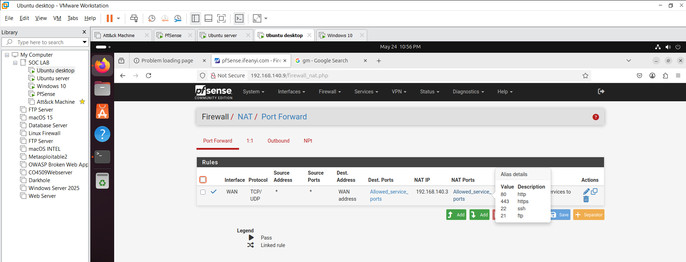

    Figure 9: Portforwarding Configuration : This exposes internal services to the internet for public reach. The ssh, web, and FTP services are intentionally exposed.

 </center>


 2. SIEM Installation:
 The job of the a SIEM is to  Collect logs from endpoint devices,Detect security events, Correlates attacks,generate alerts on on a centralized Monitoring system.

Installations was done using   <a href="https://documentation.wazuh.com/current/quickstart.html"> wazuh quickstart documentation. </a>


*  Wazuh Manager Installation :
 The wazuh maanger Analyzes data from agents, detects and correlate anomalies , events and provides threat intelligence and visualization dashboard.
 
 >*  curl -sO https://packages.wazuh.com/4.14/wazuh-install.sh && sudo bash ./wazuh-install.sh -a -v

> - sudo systemctl daemon-reload 
> -  sudo  systemctl enable wazuh-agent 
> - sudo systemctl start wazuh-agent


<center>
    Figure 10: Wazuh Manager Installation command
 </center>

 *  Wazuh Agent configuration
 This is configured on all endpoint within the internal network. the agent  collects log data, detect malware and check for file integrity and responds to threat .etc

 > * Invoke-WebRequest -Uri https://packages.wazuh.com/4.x/windows/wazuh-agent-4.14.5-1.msi -OutFile $env:tmp\wazuh-agent; msiexec.exe /i $env:tmp\wazuh-agent /q WAZUH_MANAGER='192.168.140.12' WAZUH_AGENT_NAME='WindowsDesktop' 

> *  NET START Wazuh

 <center> 
    Figure 11: Wazuh agent installation command
 </center>

## Results
<center>
    
   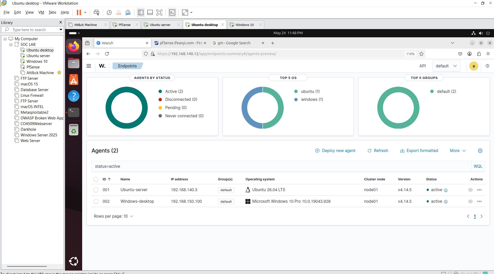

        Figure 12: SIEM dashboard view showing active agents

 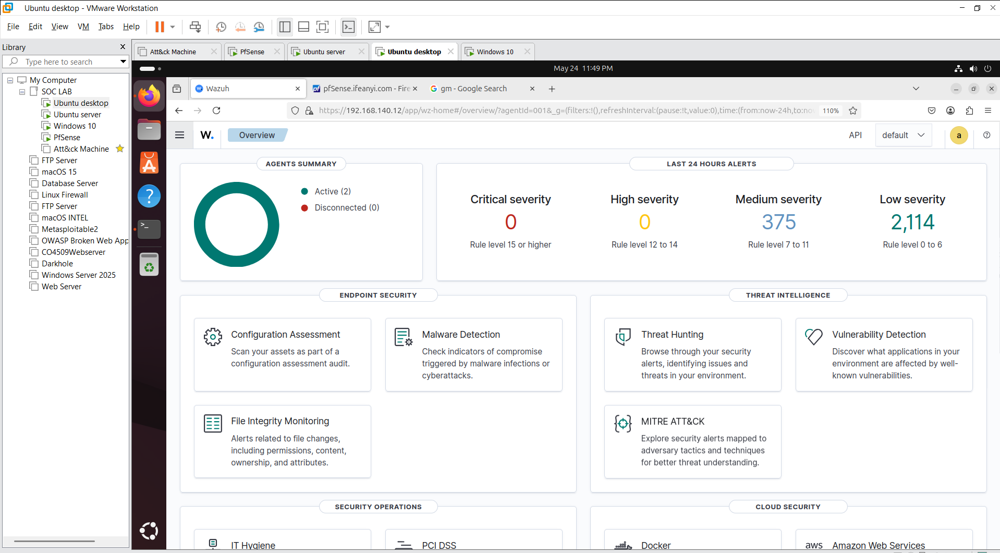

        Figure 13: SIEM dashboard view showing alerts 

 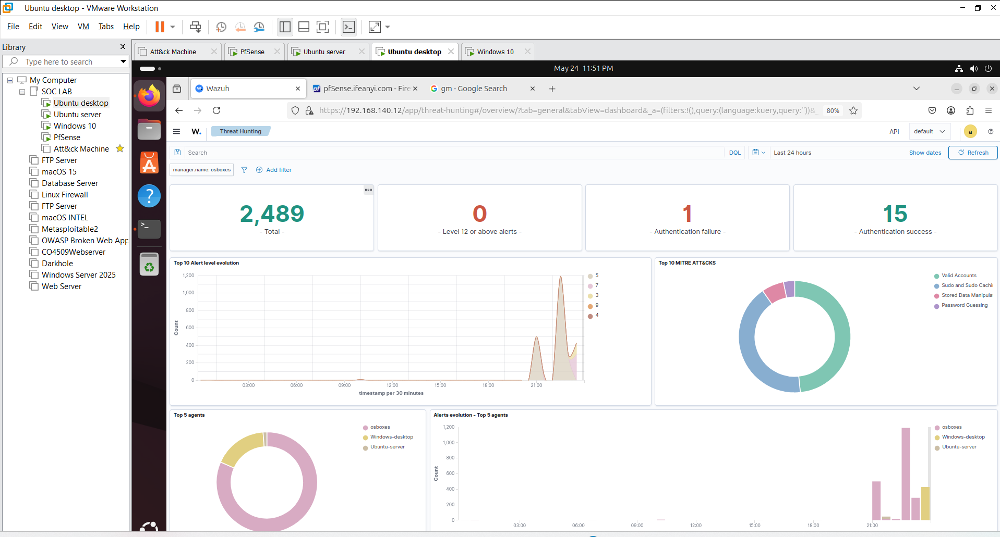

        Figure 14: Threat hunting dashboard 

</center>


 3. Pfsense Remote log configuration:
 This was achieved by using the built-in Syslog forwarding feature in pfSense to send logs to the centralized manager. This approach serves as an alternative to installing Wazuh agents on network devices(e.g firewall, routers,switch,access point), which could potentially disrupt operations or cause system issues.

- Configuration:
 
  * Configure remote logging on Pfsense Firewall.

  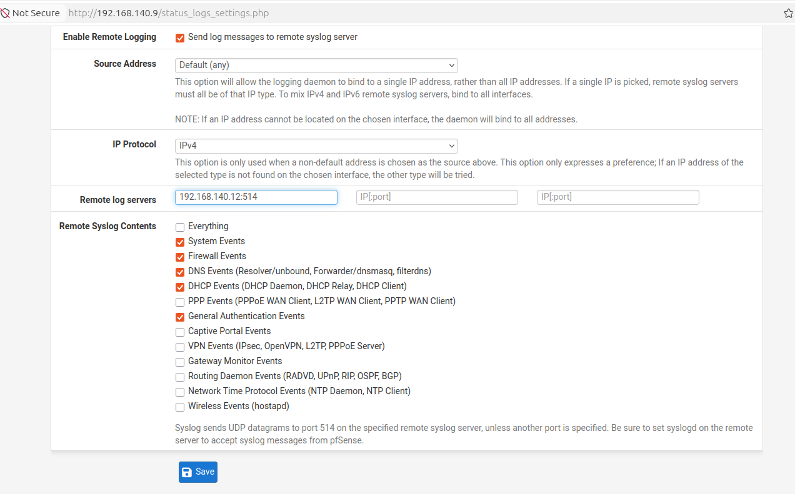

  * Allow UDP port 514 on the firewall LAN interface to enable pfSense to directly communicate with the centralized Wazuh manager for Syslog forwarding.

  * configure Wazuh manager to recieve logs via udp port 514.

  > sudo nano /var/ossec/etc/ossec.conf

    ```xml
    <remote>
    <connection>syslog</connection>
    <port>514</port>
    <protocol>udp</protocol>
    <allowed-ips>192.168.140.8/29</allowed-ips>
    <local_ip>192.168.140.12</local_ip>
  </remote>
    ```

4.  Decoders :

    Custom decoders were used to aid wazuh log ingestion. Decoders are used to extract needed information from logs to ease analysis. Parent and child decoder ae used to further customize log ingestion.
    Information on wazuh decoders was used as recommended. <a href="https://documentation.wazuh.com/current/user-manual/ruleset/ruleset-xml-syntax/decoders.html">see wazuh decoders syntax . </a>

    <center>
    
    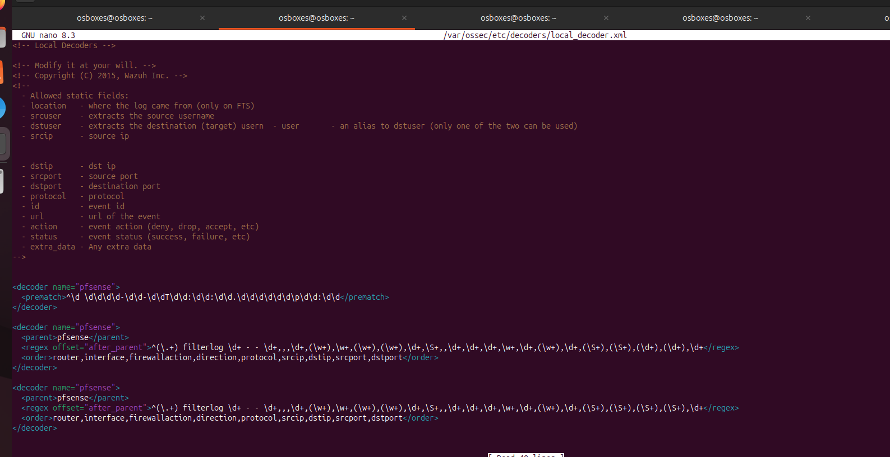

        Figure 15: Decoder Configuration 

    </center>

    > nano /var/ossec/etc/decoders/local_decoder.xml

     ```xml
     
    <decoder name="pfsense">
    <prematch>^\d \d\d\d\d-\d\d-\d\dT\d\d:\d\d:\d\d.\d\d\d\d\d\d\p\d\d:\d\d</prem>
    </decoder>

    <decoder name="pfsense">
    <parent>pfsense</parent>
    <regex offset="after_parent">^(\.+) filterlog \d+ - - \d+,,,\d+,(\w+),\w+,(\w>
    <order>router,interface,firewallaction,direction,protocol,srcip,dstip,srcport>
    </decoder>

    <decoder name="pfsense">
    <parent>pfsense</parent>
    <regex offset="after_parent">^(\.+) filterlog \d+ - - \d+,,,\d+,(\w+),\w+,(\w>
    <order>router,interface,firewallaction,direction,protocol,srcip,dstip,srcport>
    </decoder>


    ```

5.  Custom Rules :

    Rules enables wazuh to generate alerts when all specified conditions within the rule are met. Multiple rules were configured, below are few ssh rules <a href="https://documentation.wazuh.com/current/user-manual/ruleset/ruleset-xml-syntax/rules.html"> see wazuh Rules syntax . </a>

      <center>
      
      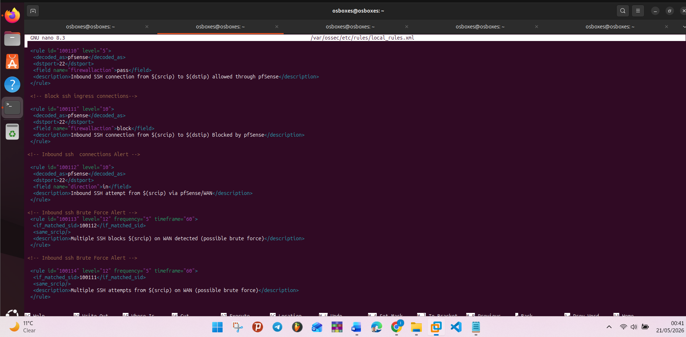

         Figure 16: Decoder Configuration 

      </center>


    > nano /var/ossec/etc/rules/local_rules.xml

      ```xml
     
    <!-- Inbound ssh  connections Alert -->

    <rule id="100112" level="10">
    <decoded_as>pfsense</decoded_as>
    <dstport>22</dstport>
    <field name="direction">in</field>
    <description>Inbound SSH attempt from $(srcip) via pfSense/WAN</description>
    </rule>

    <!-- Inbound ssh Brute Force Alert -->
    <rule id="100113" level="12" frequency="5" timeframe="60">
    <if_matched_sid>100112</if_matched_sid>
    <same_srcip/>
    <description>Multiple SSH blocks $(srcip) on WAN detected (possible brute force)</description>
    </rule>

    <!-- Inbound ssh Brute Force Alert -->

    <rule id="100114" level="12" frequency="5" timeframe="60">
    <if_matched_sid>100111</if_matched_sid>
    <same_srcip/>
    <description>Multiple SSH attempts from $(srcip) on WAN (possible brute force)</description>
    </rule>

    ```

 ## Attack simulation
An SSH brute force attack simulation was carried out using hydra to test the efficiency of the detection system. 

<center>
    
   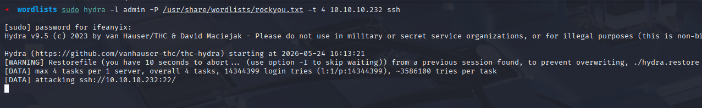

        Figure 17: Ssh Attacks 

  </center>

> sudo hydra -l admin -P /usr/share/wordlists/rockyou.txt -t 4 10.10.10.232 ssh

## Result
 <center>
    
   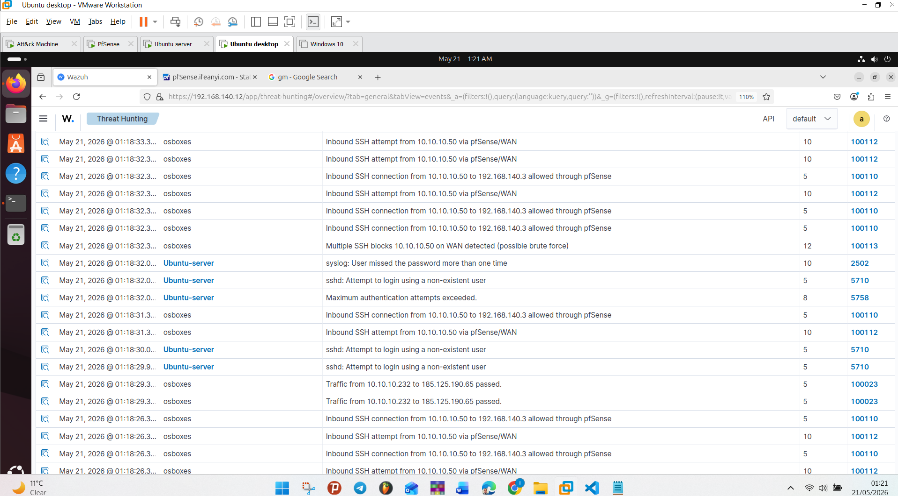

        Figure 18: Multiple ssh Alerts detected proves efficiency of custom rules.


   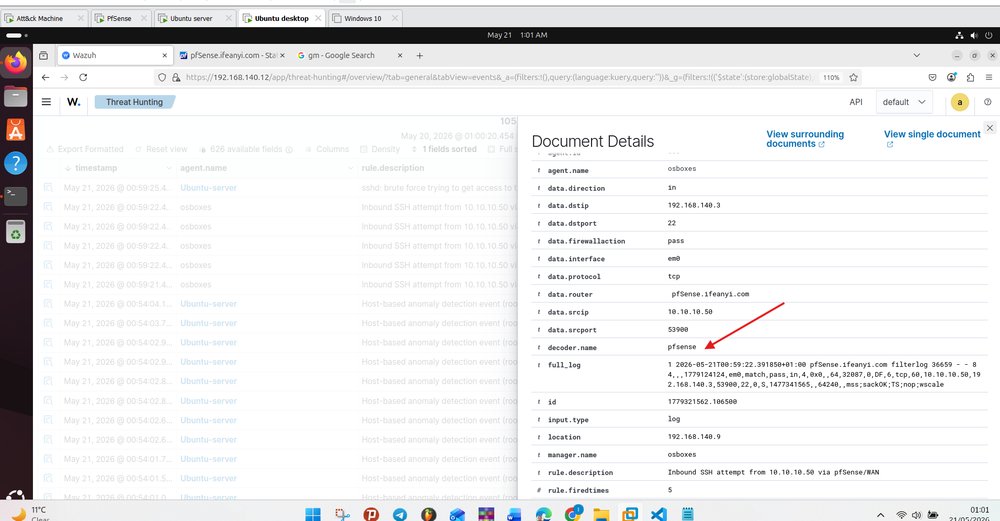

        Figure 19: ssh Alerts on WAN proves efficiency of custom decoders.
</center>


### Key Findings
- Integration of Pfsense firewall logs and wazuh improved Visibility.
- Centralized log collection and monitoring significantly improve the manageability and overall effectiveness of network security operations.
- Custom detection rules and decoders significantly improved alerting and log ingestion.
- Visualization Dashboards also improved Security Monitoring.
- Network Segmentation and Firewall Improved overall Security Posture between the internal networks and external threat.


## Recommendation 
- Organizations should always implement continuous centralized log monitoring to improve threat visibility and enable faster detection time.
- Regular update and customization  and validation of detection rules and decoders to meet the security needs of organization should be implemented.
- integration of additional intrusion detection and prevention tools like suricata or snort could further enhance the overall security posture of organizations.
- Regular security awareness training and simulated phishing campaigns should be conducted to educate employees against sophisticated phising attacks which could bypass traditional network security controls.

## Lesson Learned

- The use of official documentation in preventing misconfiguration should not be underestimated as it ensures accuracy, and reliability in system configuration.
- Centralized logging greatly improves incident visibility and investigation as wazuh makes it easier to correlate events across endpoints, firewalls.
- Effective Log ingestion and anomalies detection depends on rule and decoder customization.
- User awareness is a crictical aspect of cybersecurity as Network security tools alone are not sufficient for full  enterprise protection, , attacks such as phishing can still succeed by targeting users rather than infrastructures.
- Proper network segmentation reduces attack surface and impact.
- Active and Continuous monitoring is essential for timely detection of malicious activities within our network.

## Next Step
- integration of pfSense, IDS and  SIEM 
- Attack simulation with Metasploit
- Integration of integrity monitoring 
- Deeper threat Investigations


 


